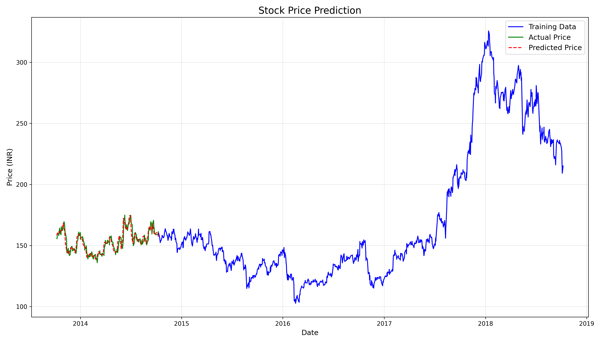

# Stock Price Predictor

A deep learning model using Long Short-Term Memory (LSTM) neural networks to predict stock prices based on historical data. This project demonstrates how to use LSTM networks for time series forecasting in financial markets.

## Overview

This project trains an LSTM model on one year of historical data from TataGlobal shares on the National Stock Exchange (NSE) to predict future stock prices.



## Introduction to Stock Market Analysis

Stock market analysis is typically divided into two main approaches:

1. **Fundamental Analysis**: Evaluates a company's future profitability based on its business environment and financial performance.

2. **Technical Analysis**: Uses charts, statistical patterns, and historical price data to identify trends and make predictions.

This project focuses on technical analysis using deep learning to predict stock price movements.

## LSTM Neural Networks

Long Short-Term Memory (LSTM) networks are a specialized type of recurrent neural network (RNN) designed to handle sequential data like time series.

Key characteristics of LSTM networks:
- Capable of learning long-term dependencies in data
- Contains specialized gates (input, output, and forget gates) that regulate information flow
- Effectively addresses the vanishing gradient problem common in traditional RNNs
- Particularly well-suited for time series data with unknown intervals between important events


## Project Structure

```
├── data/                           # Contains historical stock price datasets
│   └── nse-tata-global.csv         # Historical NSE TataGlobal stock data (1 year)
├── logs/                           # Application logging directory
│   └── stock_prediction.log        # Detailed execution logs for debugging
├── models/                         # Trained model storage
│   └── best_model.keras            # Best performing LSTM model checkpoint
├── output/                         # Results and visualization files
│   ├── prediction_results.csv      # Tabular data of actual vs predicted prices
│   ├── stock_price_prediction.png  # Time series plot comparing predictions with actual prices
│   └── training_loss.png           # Learning curve visualization showing model convergence
├── utils/                          # Helper modules and functions
│   ├── __init__.py                 # Package initialization
│   └── model_utils.py              # Data preprocessing, model building, and evaluation utilities
├── LICENSE                         # MIT License file
├── README.md                       # Project documentation and usage instructions
├── requirements.txt                # Python dependencies with version specifications
└── stock_predictor.py              # Main application entry point with execution logic
```

## Project Features

- Data preprocessing and normalization
- LSTM model architecture optimized for time series prediction
- Model training with early stopping to prevent overfitting
- Performance evaluation using RMSE and R² metrics
- Visualization of predicted vs actual stock prices
- Modular code structure for better maintainability

## Requirements

```
matplotlib==3.9.4
pandas==2.2.3
scikit-learn==1.6.1
tensorflow==2.19.0
```

## How to Run

1. Clone this repository
2. Install required dependencies: `pip install -r requirements.txt`
3. Run the prediction model: `python stock_predictor.py`

## Results

The model generates predictions on test data and evaluates performance using standard metrics. Results are saved to the `output` directory:
- `stock_price_prediction.png`: Visual comparison of actual vs predicted prices
- `training_loss.png`: Model training loss curve
- `prediction_results.csv`: Detailed prediction results

## License

This project is licensed under the terms of the included LICENSE file.
